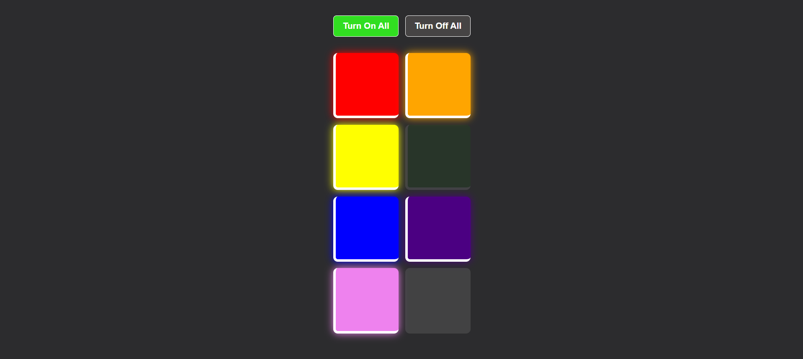

# 🌈 Colour Switches

A React app featuring 8 coloured lights that can be toggled on and off individually, with buttons to turn all lights on or off.

---

## 🚀 Features

- Toggle individual lights on/off by clicking.
- Visual glow effect when lights are turned on.
- Buttons to turn all lights on or off simultaneously.
- Smooth CSS transitions and button hover/active states.

---

## 📸 Screenshot

